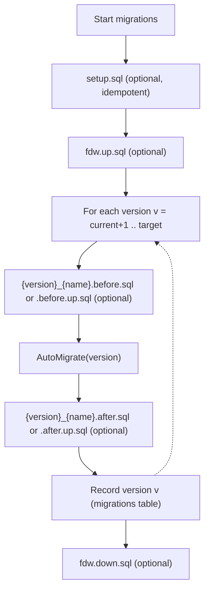
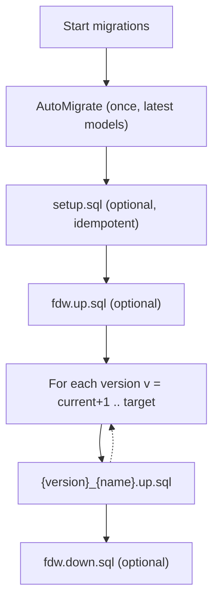

# Migration Approaches

This repository supports **two migration flows** for services using `pkg/db`.
Choose the versioned flow if you need per‑version interleaving, or the legacy
flow for a single AutoMigrate pass.

## 1) Versioned Migration Flow

Use when you need **interleaving** per migration version.

**API**
- `WithVersionedMigrationFunc(func(*gorm.DB, uint) error)`
- Optional: `WithMigrationVersion(version)`

**Behavior**
- Runs `setup.sql` once (idempotent).
- Runs `fdw.up.sql` / `fdw.down.sql` once (optional).
- For each version from current+1 to target:
  1. Versioned before script (optional)
  2. `AutoMigrate(version)` (service implementation)
  3. Versioned after script (optional)
  4. Record version **after** the full sequence completes

**Notes**
- Missing before/after scripts are skipped.
- The version bump represents completion of before + AutoMigrate + after.
- **Recording a version** means updating the `migrations` table used by
  `golang-migrate` with the new version number.
- **Supported naming (versioned flow only):**
  - Before: `{version}_{name}.before.sql` **or** `{version}_{name}.before.up.sql`
  - After: `{version}_{name}.after.sql` **or** `{version}_{name}.after.up.sql`

**Diagram**

## 2) Legacy Migration Flow

Use when you want a single AutoMigrate call and minimal changes to existing
services.

**API**
- `WithMigrationFunc(func(*gorm.DB) error)`
- Optional: `WithMigrationVersion(version)`

**Behavior**
- Runs **one** AutoMigrate (latest models).
- Runs `setup.sql` (idempotent), then `fdw.up.sql` (optional).
- Runs numbered SQL migrations via `golang-migrate`:
  - `{version}_{name}.up.sql` / `{version}_{name}.down.sql`
- Runs `fdw.down.sql` (optional).

**Diagram**

## File Naming Summary

Versioned flow:
- Before: `{version}_{name}.before.sql` or `{version}_{name}.before.up.sql`
- After: `{version}_{name}.after.sql` or `{version}_{name}.after.up.sql`

Legacy flow:
- SQL migrations: `{version}_{name}.up.sql`

Shared:
- Setup: `setup.sql`
- FDW: `fdw.up.sql`, `fdw.down.sql`
